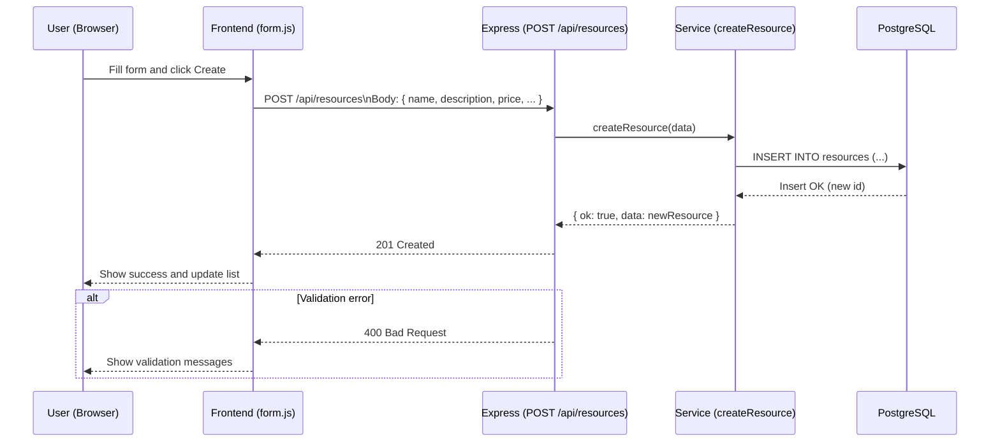
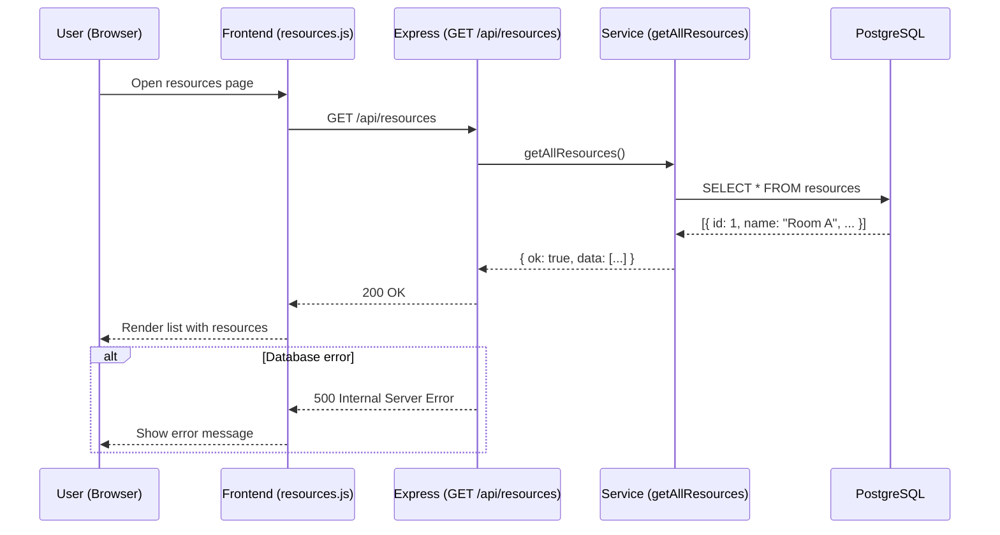
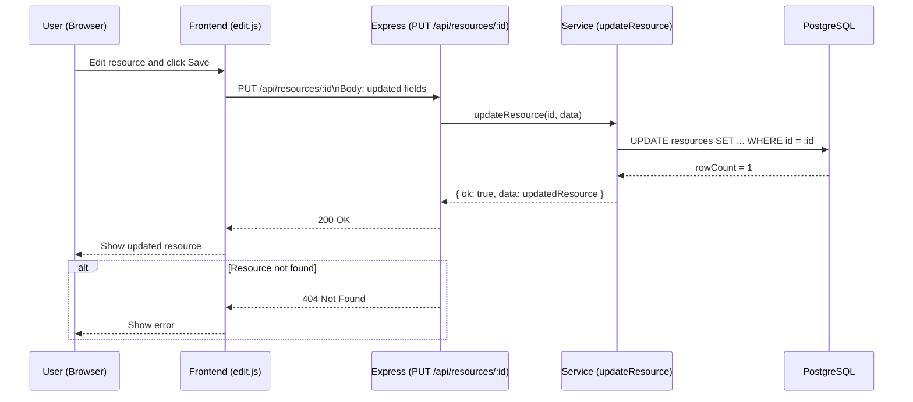
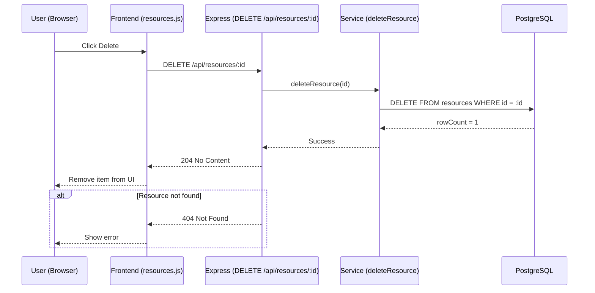

# G1 – CRUD Data Flow (Phase 6)

## CREATE – Add new resource

```mermaid
sequenceDiagram
    participant U as User (Browser)
    participant FE as Frontend (form.js)
    participant BE as Express (POST /api/resources)
    participant S as Service (createResource)
    participant DB as PostgreSQL

    U->>FE: Fill form and click Create
    FE->>BE: POST /api/resources\nBody: { name, description, price, ... }
    BE->>S: createResource(data)
    S->>DB: INSERT INTO resources (...)
    DB-->>S: Insert OK (new id)
    S-->>BE: { ok: true, data: newResource }
    BE-->>FE: 201 Created
    FE-->>U: Show success and update list

    alt Validation error
        BE-->>FE: 400 Bad Request
        FE-->>U: Show validation messages
    end
```

## READ – Get all resources

```mermaid
sequenceDiagram
    participant U as User (Browser)
    participant FE as Frontend (resources.js)
    participant BE as Express (GET /api/resources)
    participant S as Service (getAllResources)
    participant DB as PostgreSQL

    U->>FE: Open resources page
    FE->>BE: GET /api/resources
    BE->>S: getAllResources()
    S->>DB: SELECT * FROM resources
    DB-->>S: [{ id: 1, name: "Room A", ... }]
    S-->>BE: { ok: true, data: [...] }
    BE-->>FE: 200 OK
    FE-->>U: Render list with resources

    alt Database error
        BE-->>FE: 500 Internal Server Error
        FE-->>U: Show error message
    end
```

## UPDATE – Modify existing resource

```mermaid
sequenceDiagram
    participant U as User (Browser)
    participant FE as Frontend (edit.js)
    participant BE as Express (PUT /api/resources/:id)
    participant S as Service (updateResource)
    participant DB as PostgreSQL

    U->>FE: Edit resource and click Save
    FE->>BE: PUT /api/resources/:id\nBody: updated fields
    BE->>S: updateResource(id, data)
    S->>DB: UPDATE resources SET ... WHERE id = :id
    DB-->>S: rowCount = 1
    S-->>BE: { ok: true, data: updatedResource }
    BE-->>FE: 200 OK
    FE-->>U: Show updated resource

    alt Resource not found
        BE-->>FE: 404 Not Found
        FE-->>U: Show error
    end
```

## DELETE – Remove resource

```mermaid
sequenceDiagram
    participant U as User (Browser)
    participant FE as Frontend (resources.js)
    participant BE as Express (DELETE /api/resources/:id)
    participant S as Service (deleteResource)
    participant DB as PostgreSQL

    U->>FE: Click Delete
    FE->>BE: DELETE /api/resources/:id
    BE->>S: deleteResource(id)
    S->>DB: DELETE FROM resources WHERE id = :id
    DB-->>S: rowCount = 1
    S-->>BE: Success
    BE-->>FE: 204 No Content
    FE-->>U: Remove item from UI

    alt Resource not found
        BE-->>FE: 404 Not Found
        FE-->>U: Show error
    end
```
